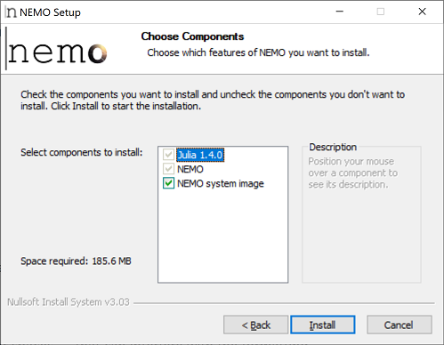
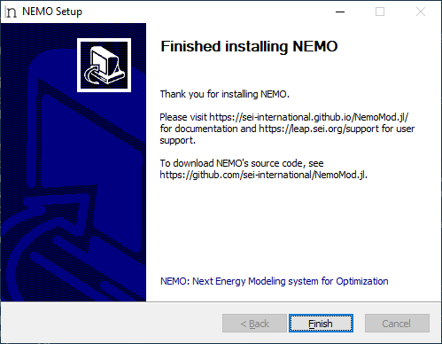

```@meta
CurrentModule = NemoMod
```
# [Installing NEMO](@id installation)

NEMO can be installed in two ways: through an installer program and manually via GitHub.

## [Installer program](@id installer_program)

The installer program is the easiest way to install NEMO. Here are the steps to follow:

1. Download a copy of the installer to your computer and run it. The installer is distributed through the [LEAP website](https://leap.sei.org/download) and is freely available once you register for the site (registration is also free).

2. The installer will step you through the installation process. You'll be prompted to accept the NEMO license (the [Apache License, version 2.0](http://www.apache.org/licenses/LICENSE-2.0)) and asked which components of NEMO you'd like to install.

   

   NEMO is built with the [Julia programming language](https://julialang.org/), so the first component is a version of Julia that's compatible with the version of NEMO you're installing. The second component is the NEMO software itself. Both the first and second components are obligatory.

   The third component, which is optional, is a pre-compiled session environment (system image) for Julia that includes support for NEMO. Ordinarily, Julia compiles programs like NEMO at run-time, a feature that impairs performance when a program is started. The NEMO system image avoids this performance penalty by providing NEMO in a pre-compiled form. **It is recommended for all users, especially those who are using NEMO with LEAP.** Note, though, that if the NEMO system image is installed, any customizations you make to the NEMO code won't take affect unless you [restore the default Julia system image](@ref restore_default_sysimage).

3. Select the components to install, and press the Install button. Then follow the prompts to finish the installation (some steps may take a few minutes). The installer will tell you when the installation is complete.

   

!!! note
    At present, an installer is only available for Windows 10 and 11 64-bit. Users on other platforms should refer to [GitHub installation](@ref github_installation) below.

### Uninstalling NEMO

If you installed NEMO with the installer program, you should be able to reverse the installation using your operating system's normal uninstall function. In Windows, go to Start -> Add or remove programs, and choose to uninstall NEMO.

### Updating NEMO

If you installed with the installer program and want to update to a new version of NEMO, simply run the new installer. It's not necessary to uninstall the old version of NEMO first.

### Troubleshooting problems with installer program

If the installer program encounters an error, it should report the problem to you and provide instructions on recommended next steps. If these steps do not resolve the issue, please email [Jason Veysey](https://www.sei.org/people/jason-veysey/) for assistance.

### [Restoring default Julia system image](@id restore_default_sysimage)

If you install the NEMO system image when running the NEMO installer, you can restore Julia's default system image as follows.

**Steps in Windows**

* Close any Julia windows or processes.
* Open the Julia library directory (typically `%ALLUSERSPROFILE%\Julia\<Julia version>\lib\julia`).
* Replace `sys.dll` with `sys.dll.nemo_backup`.

Once you do this, there will be a performance penalty when starting NEMO, but any customizations you make to the NEMO code will take effect.

!!! tip
    It's a good practice to back up the NEMO system image before overwriting it. That way, you'll be able to restore it if desired.

## [GitHub installation](@id github_installation)

To install NEMO from GitHub, you must first have a working Julia installation on your computer. **The NEMO team has verified NEMO's compatibility with Julia 1.5; other versions of Julia may not work correctly.**

Once Julia is set up, start a Julia session and add the NEMO package (named `NemoMod`):

```julia
julia> ]

pkg> add https://github.com/sei-international/NemoMod.jl
```

This will install the latest NEMO code from GitHub (which may include pre-release code). To install a particular version of NEMO, find its commit hash on the [NEMO GitHub releases page](https://github.com/sei-international/NemoMod.jl/releases) and insert it at the end of the add command after a `#` sign. For example, for NEMO 1.0.5:

```julia
pkg> add https://github.com/sei-international/NemoMod.jl#84705cc0b56435a1a2e7c2d3d0e91afc5b46922d
```

## [Solver compatibility](@id solver_compatibility)
When you [calculate a scenario](@ref scenario_calc) in NEMO, the tool formulates an optimization problem that must be solved by a compatible solver. In general, this process yields a conventional linear programming (LP) problem, but certain run-time options can change the problem type.

!!! note

    NEMO generates an ordinary LP optimization problem when calculating a scenario unless you do one of the following:
    * Set the [capacity of one technology unit](@ref CapacityOfOneTechnologyUnit) parameter (creates a mixed-integer linear programming [MILP] problem)
    * Set the `continuoustransmission` argument for [`calculatescenario`](@ref) to `false` (creates a MILP problem if transmission modeling is enabled)
    * Model a [transmission line](@ref transmissionline) with a non-zero variable cost (creates a MILP problem if transmission modeling is enabled)
    * Model a transmission line whose efficiency is less than 1 using [transmission modeling type 3](@ref TransmissionModelingEnabled) (creates a MILP problem)
    * Run a direct current optimized power flow simulation using [transmission modeling type 1](@ref TransmissionModelingEnabled) (creates a problem with a quadratic term)
    * Set the `forcemip` argument for `calculatescenario` to `true` (creates a MILP problem)

Optimization operations in NEMO are carried out with version 1.2.0 of the [JuMP](https://github.com/jump-dev/JuMP.jl) package. In principle, NEMO is compatible with any solver that can be called through JuMP, but you must ensure the selected solver can handle the problem you're presenting (LP/MILP/quadratic). For a list of solvers that work with JuMP, see [the JuMP documentation](https://jump.dev/JuMP.jl/v1.2.0/installation/#Supported-solvers).

A solver can be specified when calculating a scenario in NEMO by passing a JuMP `Model` object that references the solver to NEMO's [`calculatescenario`](@ref) method. For example:

```julia
julia> NemoMod.calculatescenario("c:/temp/scenario_db.sqlite"; jumpmodel = Model(optimizer_with_attributes(GLPK.Optimizer, "presolve" => true)))
```

Note that in order to do this, you must have the corresponding Julia interface (package) for the solver installed on your computer.

NEMO has been tested for compatibility with the following solver packages (which in turn support the listed versions of the associated solvers).

| Solver | Julia package version | Solver program versions |
|:--- | :-- |:-- |
| [Cbc](https://github.com/jump-dev/Cbc.jl) | 1.0.1 | 2.10.5 |
| [CPLEX](https://github.com/jump-dev/CPLEX.jl) | 0.9.3 | 12.10 - 22.1 |
| [GLPK](https://github.com/jump-dev/GLPK.jl) | 1.0.1 | 5.0 |
| [Gurobi](https://github.com/jump-dev/Gurobi.jl) | 0.11.3 | 9.0 - 9.5 |
| [Mosek](https://github.com/jump-dev/MosekTools.jl) | 1.2.3 | 9.3.21 |
| [Xpress](https://github.com/jump-dev/Xpress.jl) | 0.15.1 | 8.4 - 8.13 |

!!! tip
    Older versions of NEMO may be compatible with older versions of these solvers. For example, [NEMO 1.2](https://github.com/sei-international/NemoMod.jl/releases/tag/v1.2) is compatible with CPLEX 12.8 - 12.9 and Gurobi 7 - 8.

If you install NEMO with the [NEMO installer](@ref installer_program), all of the preceding solver packages will be installed as well. The packages for the open-source solvers (GLPK and Cbc) come with the underlying solver programs, so you should be able to use these solvers immediately upon installation.

The Mosek Julia package also provides the underlying solver program. In this case, though, you must have a valid Mosek license installed on your computer in order to use the solver. Typically, for a single-computer license (a server license), a license file must be installed at `%USERPROFILE%\mosek\mosek.lic` (Windows) or `$HOME/mosek/mosek.lic` (Linux or MacOS). See the [Mosek documentation](https://www.mosek.com/resources/getting-started/) for more information.

The Julia packages for CPLEX, Gurobi, and Xpress do **not** include the corresponding solver programs. These must be licensed and set up separately. If CPLEX, Gurobi, or Xpress is installed on your computer when you run the NEMO installer, the installer will link the Julia package to the solver binaries. Otherwise, you may need to perform this step yourself:

**CPLEX**

```julia
julia> using Pkg

julia> Pkg.build("CPLEX")
```

**Gurobi**

```julia
julia> using Pkg

julia> Pkg.build("Gurobi")
```

**Xpress**

```julia
julia> using Pkg

julia> Pkg.build("Xpress")
```

!!! warning
    NEMO may not be compatible with solvers and solver versions not listed above. The NEMO team generally does not provide support to troubleshoot issues with such solvers or versions.
